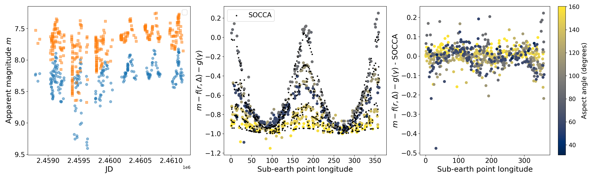

# SOCCA-TUNE
## TechniqUe for iNitial parameter Estimation

```socca-tune``` is a Python package for extracting physical properties of Solar System Objects (SSOs) from sparse multi-band photometry, 
using the ```SOCCA``` model (Shape, Orientation, and Colors Combined Algorithm) (citation needed).
It is designed for large survey data (e.g. LSST, ZTF).
It requires ```phunk``` 

### Features
- Joint modeling of:

1. Phase function ($H$, $G_1, G_2$)
2. Sidereal rotation period ($P_\text{sid}$)
3. Spin axis orientation ($\alpha, \delta$)
4. Shape (triaxial ellipsoid: $a/b, a/c$)

- Works with sparse, irregularly sampled photometry thanks to [nifty](https://github.com/flatironinstitute/nifty-ls)!
- Multi-band fitting
- Built-in:
1. Period search (Lomb–Scargle + model selection)
2. Period alias and bogus flagging 
3. Initialization via ```sHG1G2``` ([Carry+2024](https://ui.adsabs.harvard.edu/abs/2024A%26A...687A..38C/abstract))

### Installation
Using ```pip```

```
pip install socca-tune
```

or by cloning the repository
```
git clone https://github.com/astrockers/socca-tune
cd socca-tune
pip install -e .
```

### Quick example
```
from socca_tune.initialize import initialize 
import phunk
import requests
import io
```

Let's pick an example SSO, in this case (624) Hektor.
We can get the observations of Hektor from ZTF using the FINK alert broker's API, arguably the easiest method to collect sparse SSO photometry.
For more info on FINK, [click here](https://fink-broker.org/)

```
target = "Hektor"

# get data for target
r = requests.post(
    "https://api.ztf.fink-portal.org/api/v1/sso",
    json={
        "n_or_d": f"{target}",
        "withEphem": True,
        "withResiduals": True,
        "output-format": "json",
    },
)

# Format output in a DataFrame
data = pd.read_json(io.BytesIO(r.content))
```

We can now load the different columns as provided from FINK into a ```PhaseCurve``` object and do an ephemeris call to collect auxiliary information required by SOCCA (such as the sub-Solar coordinates of our target.)

```
pc = phunk.PhaseCurve(
    target=target,
    epoch=data["Date"],
    phase=data["Phase"],
    mag=data["i:magpsf_red"],
    mag_err=data["i:sigmapsf"],
    band=data["i:fid"],
)
pc.get_ephems()

p0, metadata = initialize(pc, weights=pc.mag_err, remap=True, metadata=False)
pc.fit(models=["SOCCA"], p0=p0, weights=pc.mag_err, remap=True)
```

### How ```socca-tune``` Works 
The fitting process is staged to avoid local minima:
- Initial fit with ```sHG1G2``` which provides:
1. $H, G_1, G_2$
2. Spin axis parameter space
3. First guess for $a/b, a/c$

- Period search
1. Lomb–Scargle on ```sHG1G2``` residuals
2. Correction for the synodic-sideral period difference

- Full SOCCA fit on the spin axis minima and selected trial periods

### Photometric model
The observed apparent magnitude $m$ is modeled as:
$$m = H + f(r,\Delta) + g(\gamma) + s(\alpha, \delta, P_\text{sid}, a/b, a/c, W_0)$$

where:
- $f(r,\Delta)=5\log_{10}(r,\Delta)$ accounts for the object-observer distance variation
- $g(\gamma)$ is the phase function which accounts for the variations due to the Sun-object-observer angle ($\gamma$)
with 
$$g(\gamma) = -2.5\log_{10}(G_1\phi_1(\gamma) + G_2\phi_2(\gamma) + (1-G_1-G_2)\phi_3(\gamma))$$
and the function $s$
which models the photometric variation coming from the projection of a spinning triaxial ellipsoid.

After the fit is done, we can compare our solution with values from the bibliography (if they exist) using [SSODNet](https://ui.adsabs.harvard.edu/abs/2023A%26A...671A.151B/abstract).

```
import rocks

rock = rocks.Rock(target)

print(f"{'Parameter':<13} {'rocks':>12} {'SOCCA':>19}")
print("-" * 50)

rock_vals = {
    "RA": rock.parameters.physical.spin.RA0.value[0],
    "DEC": rock.parameters.physical.spin.DEC0.value[0],
    "Period": rock.parameters.physical.spin.period.value[0],
}

socca_vals = {
    "RA": pc.SOCCA.alpha,
    "DEC": pc.SOCCA.delta,
    "Period": pc.SOCCA.period * 24,
}

for key in rock_vals:
    print(f"{key:<10} {rock_vals[key]:19.6f} {socca_vals[key]:19.6f}")
```

We can also take a look at what the data look like vs the model we just computed. Notice how the size of the lightcurve grows as our line of sight goes closer to the asteroid's equator!

